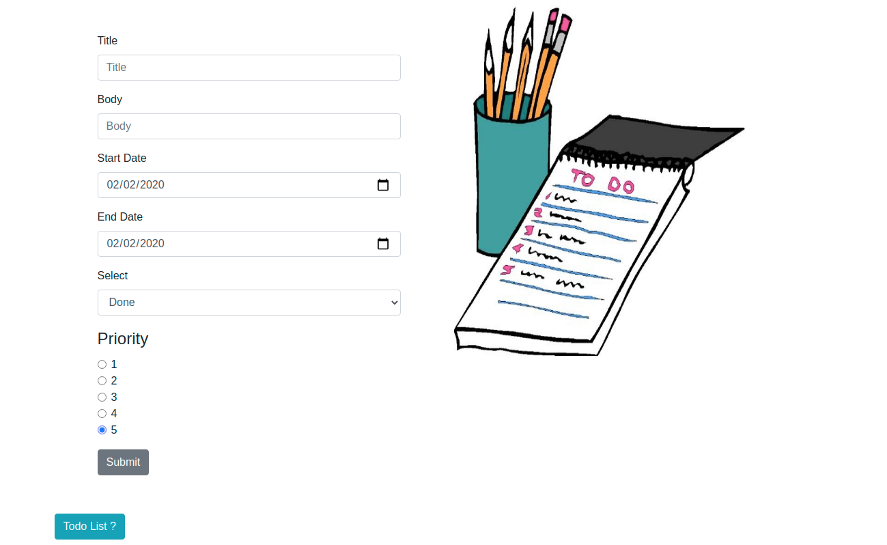
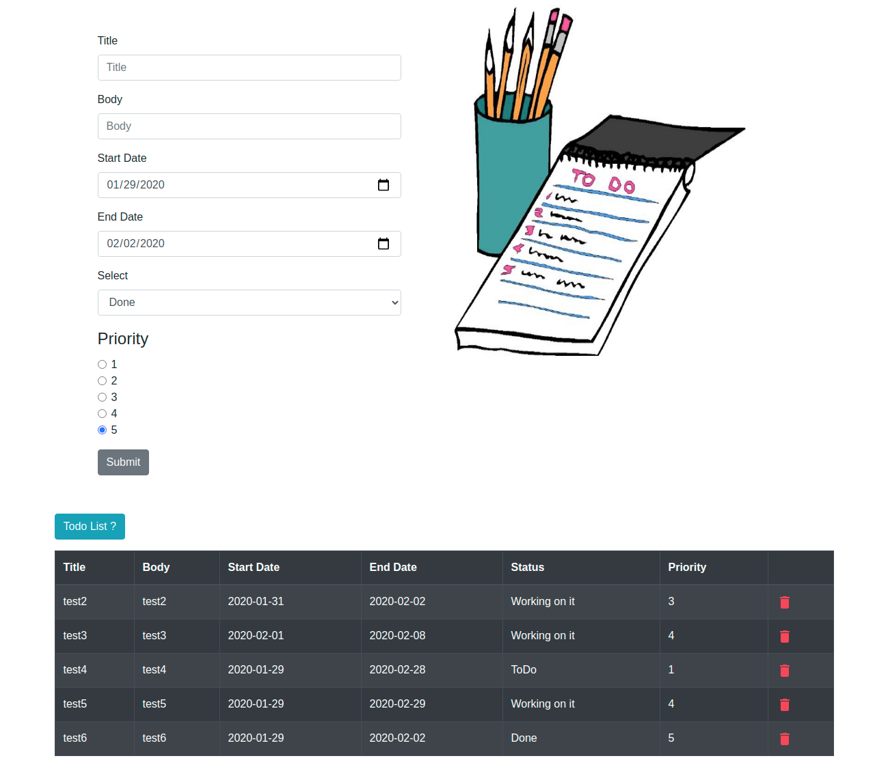

# TODO_MERN
Todo App using MongoDB Express ReactJS NodeJS

## Installation
get all dependencies

```bash
npm install
npm install-client
```
## Demo

### Hosting URL
https://mern-todo277.herokuapp.com/

### Screenshots






